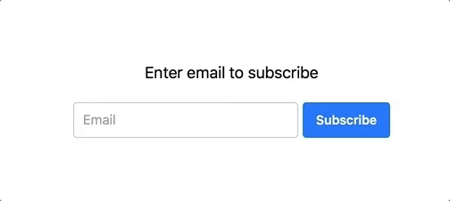

# Email provider service detector 


Detect Provider's Service name by email address

```js
team@youtube.com -> { name: 'Gmail', url: 'https://googlemail.com' }
test@kinopoisk.ru -> { name: 'Яндекс', url: 'https://yandex.ru' }

```

## Why

It can be useful for improving User Experience after entering an email address:
 
1) User enters an email address
2) You have sent confirmation email to him
3) On the same place, you can show `Open Gmail|Yahoo|Яндекс|etc` button  

 

## How it words

1. Fetching DNS MX records for email address
2. Find MX host at the free email services datastore, collected by [freemail](https://github.com/willwhite/freemail/blob/master/data/free.txt)
3. Find Service product name by its hostname (`googlemail.com` -> `Gmail`) 

## Usage

### Install

```js
npm i --save email-provider
```

or

```js
yarn add email-provider
```

### Connect and call

```js 
const emailProvider = require('email-provider');

let email = 'test@google.com';

emailProvider.get(email)
     .then( service => {
       console.log(service.name); // Gmail
       console.log(service.url); // https://googlemail.com
     })
     .catch( error => {
       console.log('Email provider was not reached:', error);
     })
```

## License 

MIT